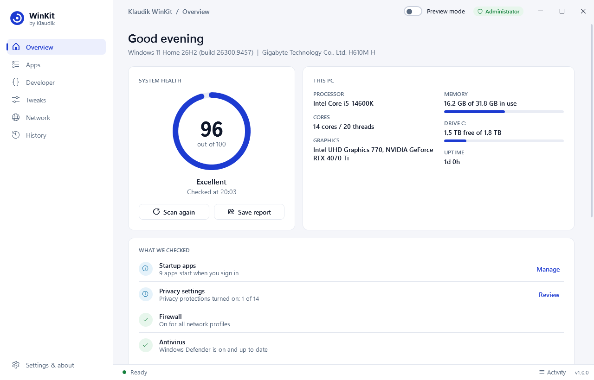
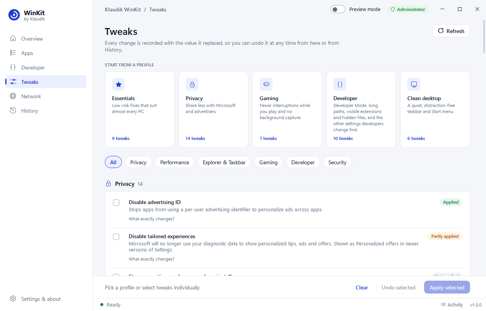
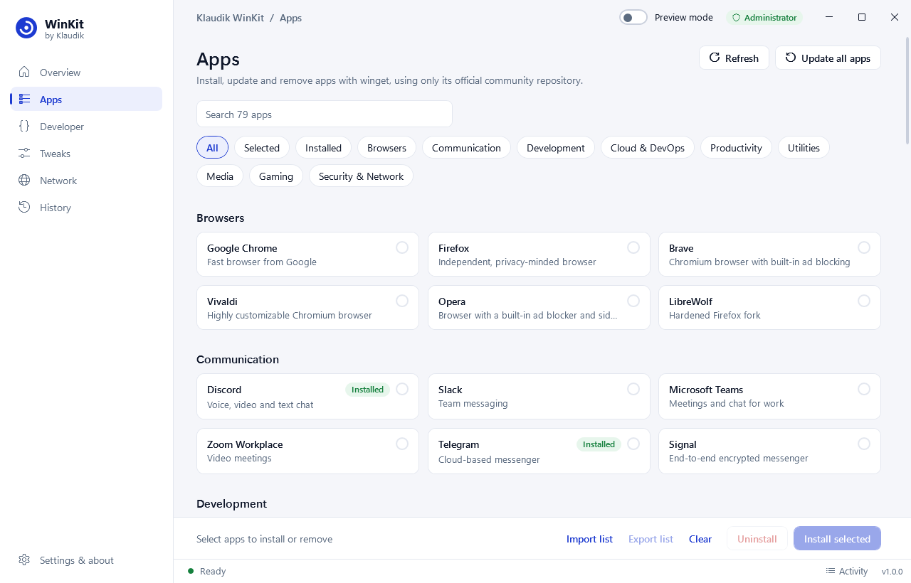
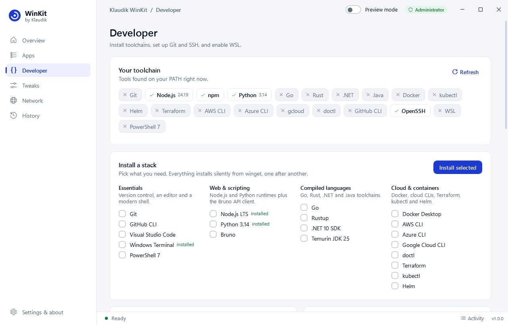
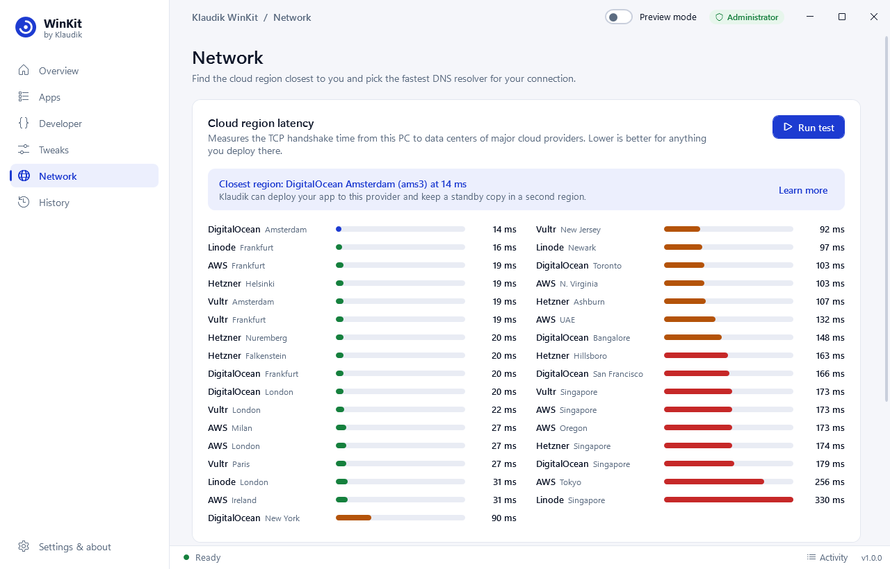
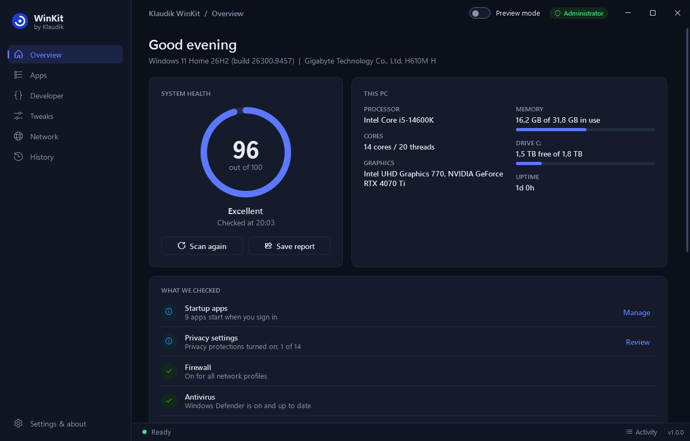
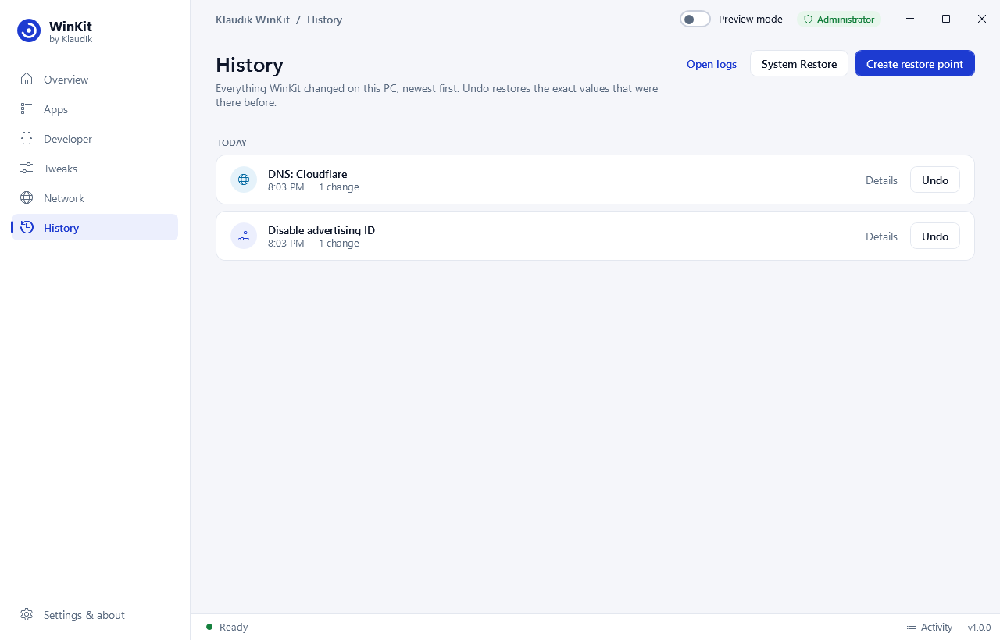

<p align="center">
  
</p>

<h1 align="center">Klaudik WinKit</h1>

<p align="center">
  An open-source toolkit for setting up and tuning Windows 10 and 11.<br>
  Every tweak and DNS change it makes is recorded and can be undone with one click.
</p>

<p align="center">
  <a href="https://github.com/klaudikdev/winkit/actions/workflows/ci.yml"></a>
  <a href="https://github.com/klaudikdev/winkit/releases/latest"></a>
  <a href="LICENSE"></a>
</p>



## Start WinKit

Open **PowerShell** and run:

```powershell
irm https://klaudik.com/win | iex
```

The launcher downloads a pinned release from GitHub, checks its SHA-256, asks Windows for administrator rights and starts it. Nothing is installed, and closing the window leaves no background process behind.

Prefer to check everything yourself first? See [Run without the launcher](#run-without-the-launcher).

## What it does

| | |
| --- | --- |
| **Overview** | A health score for your PC: disk space, updates, antivirus, firewall, drive health, startup apps, pending restarts and how many privacy tweaks are on, with a shortcut to the relevant setting where there is one. Save it as a self-contained HTML report. |
| **Apps** | 80+ hand-picked apps in nine categories, installed, updated or removed silently through [winget](https://learn.microsoft.com/windows/package-manager/). Export your selection and import it on your next PC. |
| **Developer** | Toolchain detection, one-click stacks (Git, VS Code, Node.js, Python, Go, Rust, .NET, Java, Docker, AWS, Azure and Google Cloud CLIs, Terraform, kubectl, Helm), Git identity, Ed25519 SSH keys and WSL. |
| **Tweaks** | 43 privacy, performance, Explorer, gaming, developer and security settings, with profiles to start from. Each one shows exactly which registry value, service, scheduled task, Windows feature, power plan or system setting it changes, and settings Windows caches are applied the way the Settings app applies them, so most take effect without a restart. |
| **Network** | Latency to 33 regions across AWS, Hetzner, DigitalOcean, Vultr and Linode, a DNS benchmark, and one-click switching between Cloudflare, Google, Quad9, AdGuard and OpenDNS. |
| **History** | A timeline of every change WinKit made, with the value it replaced. Undo any entry, even after a restart. |

<table>
  <tr>
    <td></td>
    <td></td>
  </tr>
  <tr>
    <td></td>
    <td></td>
  </tr>
  <tr>
    <td></td>
    <td></td>
  </tr>
</table>

## How WinKit keeps your PC safe

- **Settings changes are reversible.** Every change of a tweak or DNS setting is recorded the moment it is made, with the value it replaced, its type and whether it existed at all, in `%ProgramData%\Klaudik\WinKit`, a folder only administrators can write to. Undo writes back exactly that, and removes a key only if WinKit created it and it is still empty. App installs and other one-off actions cannot be undone, so WinKit asks before running them.
- **Restore point first.** Before the first tweak of a session WinKit creates a System Restore point, so Windows can roll back the whole system independently of WinKit. You can turn this off under Settings & about.
- **Preview mode.** Turn it on and every action becomes a dry run that lists what it would change. A banner across the top of the window shows while it is on.
- **Nothing hidden.** Every tweak is plain data in [`config/tweaks.json`](config/tweaks.json) and documented in [docs/TWEAKS.md](docs/TWEAKS.md). The app shows the exact change next to each tweak.
- **Security features are off-limits.** WinKit never disables Microsoft Defender, the firewall, Windows Update, UAC or SmartScreen. A test fails the build if a tweak references any of them.
- **Known sources.** Apps are installed by winget from its official community repository, which pins the SHA-256 of every installer it downloads (some, such as Visual Studio, then fetch their own components). WinKit never downloads or runs installers itself.
- **No telemetry.** No accounts, no analytics, no tracking. WinKit goes online only for winget (including the installed-apps check when you first open the Apps or Developer page), the latency and DNS tests, and the update check when you press **Check for updates**. Installing a WSL distribution runs `wsl --install`, which downloads it from Microsoft.
- **Verified download.** The launcher is pinned to the SHA-256 of one specific release. The elevated process hashes the file again and runs the exact bytes it verified, so the file cannot be swapped in between. If you would rather not trust klaudik.com, verify a GitHub release yourself as shown below.

Read [SECURITY.md](SECURITY.md) for the full threat model and how to report a vulnerability.

## Disclaimer

WinKit changes system settings, installs and removes software and runs with administrator rights. It is provided "as is", without warranty of any kind, as stated in the [MIT license](LICENSE). You use it at your own risk and are responsible for the changes you apply. Back up important data, and try changes on a non-critical PC before using WinKit on computers you depend on.

To the maximum extent permitted by law, Klaudik and the contributors are not liable for any damage, data loss, downtime or other harm arising from the use of WinKit or of the third-party software it installs. Apps are installed from the [winget community repository](https://github.com/microsoft/winget-pkgs) under their own licenses and terms; Klaudik does not provide or support them. Latency and DNS results are measurements from your connection at that moment and are not a guarantee of any provider's performance.

WinKit is an independent project and is not affiliated with, endorsed or sponsored by Microsoft. Microsoft, Windows, PowerShell and Windows Defender are trademarks of the Microsoft group of companies. Other product and company names are trademarks of their respective owners.
## Requirements

- Windows 11, or Windows 10 22H2
- Windows PowerShell 5.1 (built into Windows)
- An administrator account
- For the Apps page: [App Installer](https://apps.microsoft.com/detail/9NBLGGH4NNS1) (winget), included in current Windows versions

Windows Server 2022 and 2025 work too, and the automated tests run on both. A few tweaks are not offered on Server, and on Server 2022 you need to [install winget](https://aka.ms/getwinget) yourself to use the Apps page.

Start WinKit from Windows PowerShell or Windows Terminal. Some apps run the programs you start from their built-in terminal in a container with a private copy of the registry; WinKit detects this and asks you to use a normal PowerShell window, because its changes would not reach Windows from there. PCs where AppLocker or WDAC restrict PowerShell (Constrained Language Mode) cannot run WinKit.

On an older Windows 10 installation, the first download can fail with *Could not create SSL/TLS secure channel*. Run this instead:

```powershell
[Net.ServicePointManager]::SecurityProtocol = 'Tls12'; irm https://klaudik.com/win | iex
```

## Run without the launcher

1. Download `WinKit.ps1` and `WinKit.ps1.sha256` from the [latest release](https://github.com/klaudikdev/winkit/releases/latest).
2. Check the file against the checksum published with the release (this prints `True` when it matches). This proves the download is intact; to rule out a replaced release, also compare the hash with the one in [the launcher](https://klaudik.com/win), which is served separately:
   ```powershell
   (Get-FileHash .\WinKit.ps1 -Algorithm SHA256).Hash -eq (Get-Content .\WinKit.ps1.sha256).Split(' ')[0]
   ```
3. Start it:
   ```powershell
   powershell -ExecutionPolicy Bypass -File .\WinKit.ps1
   ```

Add `-Preview` to start in preview mode.

## Removing WinKit

WinKit does not install anything. To remove every trace, delete `%ProgramData%\Klaudik\WinKit` (history, settings and logs; this needs administrator rights) and `%TEMP%\KlaudikWinKit` (the downloaded script). Changes you made stay in place until you undo them, so undo first if you want your old settings back.

## Development

If PowerShell blocks the scripts, run `Set-ExecutionPolicy -Scope Process Bypass` first.

```powershell
# Run from source without elevation (system-wide actions will fail)
powershell -ExecutionPolicy Bypass -File .\src\WinKit.ps1 -NoElevate -Preview

# Unit, integration and safety tests
.\tests\Run-Tests.ps1

# End-to-end UI test in preview mode
powershell -STA -ExecutionPolicy Bypass -File .\tools\Test-UI.ps1

# Checks that need administrator rights, against throwaway objects
.\tools\Test-Elevated.ps1

# Build dist\WinKit.ps1, its checksum and the pinned launcher
.\build.ps1
```

The project layout and design decisions are described in [docs/ARCHITECTURE.md](docs/ARCHITECTURE.md). To add a tweak or an app, see [CONTRIBUTING.md](CONTRIBUTING.md).

## License

[MIT](LICENSE). Made by [Klaudik](https://klaudik.com).
